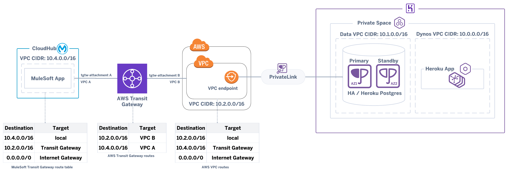

# Connecting to Heroku Postgres from MuleSoft CloudHub via PrivateLink

## DISCLAIMER

The author of this article makes any warranties about the completeness, reliability and accuracy of this information. Any action you take upon the information of this website is strictly at your own risk, and the author will not be liable for any losses and damages in connection with the use of the website and the information provided.

## Setup procedure

Connecting directly via PrivateLink to a Heroku Postgres from MuleSoft CloudHub is not (yet) supported, however, it’s possible to overcome this limitation using an intermediate AWS VPC.

1. Follow the procedure described in the article [Connecting to a Private or Shield Heroku Postgres Database via PrivateLink](https://devcenter.heroku.com/articles/heroku-postgres-via-privatelink) to create a PrivateLink to Heroku Postgres and a VPC Endpoint within an AWS VPC. You can use this [Terraform project](https://github.com/abernicchia-heroku/heroku-postgres-aws-privatelink) to automate the required tasks. Once created, the VPC endpoint should resolve to a [fixed private IP](https://repost.aws/questions/QUykbQk9gdQGyBwjkypOZulA/does-the-ip-address-created-for-private-link-interface-endpoint-can-change#ANHN7fD5z0QP-juGta608CSQ) (within the AWS VPC CIDR) via public DNS records
2. [Create an AWS Transit Gateway](https://docs.aws.amazon.com/vpc/latest/tgw/tgw-getting-started.html#step-create-tgw) 
3. [Create a Transit Gateway attachment](https://docs.aws.amazon.com/vpc/latest/tgw/tgw-getting-started.html#step-attach-vpcs) to the AWS VPC created previously (e.g. VPC B - 10.2.0.0/16)
4. [Create a MuleSoft CloudHub VPC](https://docs.mulesoft.com/runtime-manager/vpc-tutorial)  (e.g. VPC A - 10.4.0.0/16) where to deploy the applications that need to access the Heroku Postgres and assign it to a specific environment(s) (e.g. Sandbox)
5. [Create a Transit Gateway attachment](https://docs.mulesoft.com/runtime-manager/tgw-attach-arm) from CloudHub
6. [Configure the outbound traffic](https://docs.mulesoft.com/runtime-manager/tgw-attach-arm#configure_tgw_routing) from the MuleSoft CloudHub VPC to the AWS VPC
7. Edit the AWS VPC (e.g. VPC B - 10.2.0.0/16) routes and add a route to the MuleSoft CloudHub VPC (e.g. VPC A - 10.4.0.0/16) via the Transit Gateway
8. [Configure the MuleSoft Application Database Config](https://blogs.mulesoft.com/dev-guides/api-connectors-templates/connect-heroku-postgres-database-connector/) to connect to Heroku Postgres and use the VPC Endpoint URL created in step (1) (see [here](https://devcenter.heroku.com/articles/heroku-postgres-via-privatelink#connecting-the-heroku-and-amazon-vpc-endpoints)) as the database connection URL
9. Deploy the MuleSoft Application into the environment (e.g. Sandbox) assigned to the MuleSoft CloudHub VPC and using the same VPC region
10. Ensure that the MuleSoft Application worker has a private IP within the assigned MuleSoft CloudHub VPC CIDR (e.g. VPC A - 10.4.0.0/16)  using `dig mule-worker-internal-<application name>.<region>.cloudhub.io` (e.g. dig [mule-worker-internal-myapp.de-c1.eu1.cloudhub.io](http://mule-worker-internal-myapp.de-c1.eu1.cloudhub.io/))
11. Check from the logs that the MuleSoft Application worker starts correctly and that the Postgres connection is created without any errors

